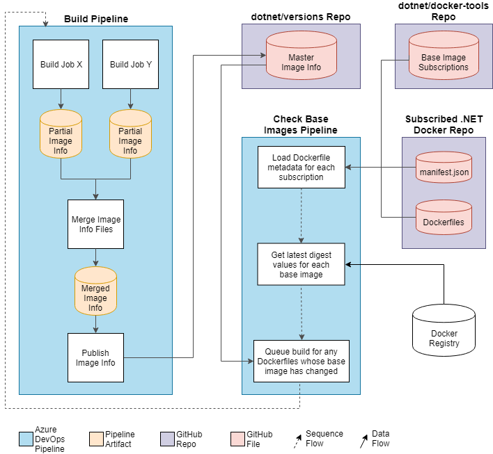

# Base Image Dependency Flow

One of the requirements for .NET Docker is to have its images rebuilt whenever a base image has changed and have them published as soon as possible.  For example, if an updated image of `alpine:3.9` is made available, all of the .NET Dockerfiles which contain `FROM alpine:3.9` should be rebuilt, including their dependencies.  This ensures a high degree of confidence by consumers of the .NET Docker images that the images include the latest patches.  As part of the .NET Docker engineering system there is an automated workflow that helps with managing this requirement.

## Tracking Base Image Digests
The first step is to make sure that we can easily determine which version of the base image that each of the .NET Docker images are dependent upon.  This is done by tracking the base image's [digest](https://docs.docker.com/engine/reference/commandline/pull/#pull-an-image-by-digest-immutable-identifier).  A digest is a unique identifier of an image.  If a newer version of the image is published, it will have a different digest value.

When an image is built, the value of its base image's digest is stored in what's called an image info file.  This JSON file contains useful metadata about images that can be easily consumed by the engineering system.  When running a build, there are several build jobs running in parallel building different images for different platforms and architectures.  Each of these build jobs are producing an image info file that contains metadata about the images that were built by that specific build job.

Once all the build jobs have finished, another task collects all the image info files produced by the jobs and merges them into a single image info file.  After the images have been published to [MCR](https://azure.microsoft.com/blog/microsoft-syndicates-container-catalog/), the contents of this image info file are merged into the main [image info](https://github.com/dotnet/versions/blob/main/build-info/docker/image-info.json) file in GitHub.

At this point, we've got a persistent record of the base image versions that each of the published .NET Docker images are dependent upon.  This is useful information to have in general.  For example, it can used when troubleshooting an issue of a .NET Docker image and it's necessary to know what specific version of its base image was being used.  But for this particular automated system, it'll be used to determine whether an image has been updated or not, which is described next.

## Checking for Updates to Base Images

Another part of the automation is an Azure DevOps pipeline that will check whether a base image has been updated and, if necessary, queues a build that will rebuild all of the affected .NET Docker images.  It runs on a schedule several times per day, every day.  The pipeline consumes a [subscriptions](https://github.com/dotnet/docker-tools/blob/main/eng/check-base-image-subscriptions.json) file that describes which of the .NET Docker repos, and which of their branches, want to participate in the process for checking base images.  The file also describes which Azure DevOps pipeline should be run for a particular repo/branch.

For each subscription described in the subscriptions file, the pipeline runs the following process:
1. Loads the manifest and Dockerfile from the subscribed repo.  The manifest contains metadata about all the images that are to be produced for the repo, how they are to be tagged, and a bunch of other information.  This file, when paired with the content of the repo's Dockerfiles, provides an easily consumable description of the base image tags that are being depended upon.
2. Now that we've got the list of base image tags that we care about, the pipeline makes use of the Docker Registry to get the latest digest values for those tags.
3. Remember that [image info](https://github.com/dotnet/versions/blob/main/build-info/docker/image-info.json) file described above?  This is where it comes in handy.  The pipeline reads that file to determine which digests the published images are dependent upon and compares them to the latest digests that were retrieved in the previous step.  If those values are different, it means the published image is making use of an older version of the image.  We need to get it updated!  The pipeline keeps track of which images, and their dependent images, need to be rebuilt.
4. If any images need to be rebuilt, the pipeline constructs a special build argument that describes the set of paths to the Dockerfiles that need to be built.  It then queues a build for the pipeline referenced by the subscription in the subscriptions file, passing it this build argument.  When that pipeline builds the images, it will ensure that the built images are making use of the latest base images, just by the nature of the build process pulling the base image before building.  You can see here that there's a virtuous cycle; when the pipeline publishes these updated images, it updates the main image info so that it now references the latest base image digests.  That is, until the next base image changes and the process starts all over again.

This entire process is hands-off automation running 7 days a week, allowing consumers of .NET Docker images to be assured they're getting the most up-to-date version of the images they care about.

## Workflow Diagram

