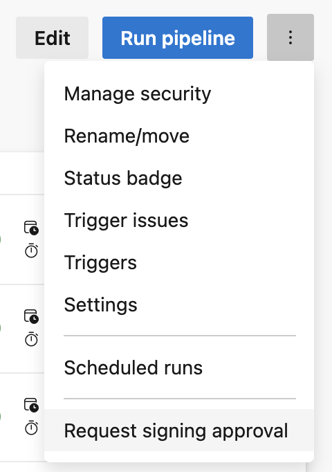

# Container Image Signing

Container image signing uses ESRP via the MicroBuild signing plugin to sign Docker images with [Notary v2](https://notaryproject.dev/) signatures. When enabled, a Sign stage runs after images are built and before they are published.

## How To Enable Image Signing

### 1. Request Signing Approval

Request signing approval for your image publishing pipeline in the Azure DevOps GUI:



Follow the instructions in the approval request form.

### 2. Enable Signing in Publish Configuration

Signing is controlled by the `Signing` property of ImageBuilder's `PublishConfiguration`. It can be
configured in two different ways:

#### For .NET Repos

Pass the `enableSigning: true` parameter to `publish-config-prod.yml` or `publish-config-nonprod.yml`:

```yaml
- template: /eng/docker-tools/templates/stages/dotnet/publish-config-prod.yml@self
  parameters:
    enableSigning: true
    # ... other parameters ...
```

#### For Other Repos

If your pipeline constructs its own `publishConfig` object, add the `Signing` section to the configuration.
The `Signing` property maps to the [`SigningConfiguration`](../src/ImageBuilder/Configuration/SigningConfiguration.cs) model.

```yaml
publishConfig:
  # ... existing publish configuration ...
  Signing:
    Enabled: true
    # Get the appropriate ESRP signing keycode from the CSSC documentation:
    #   https://aka.ms/cssc
    # Then look up the corresponding MicroBuild keycode in MicroBuild's source code:
    #   https://devdiv.visualstudio.com/Engineering/_git/Sign?version=GBmain&path=/src/CertificateMappings.xml
    # These parameters refer to the MicroBuild signing keycode.
    ImageSigningKeyCode: 1234
    ReferrerSigningKeyCode: 5678
    # Important distinction: "test" signing is not supported on Linux (MicroBuild limitation).
    # For testing, use "real" signing with a testing certificate (from the CSSC documentation).
    SignType: real
    # Selects which set of root certificates to use when verifying signatures.
    # The Notation trust store configurations and certificates are baked into the ImageBuilder image.
    # Reference src/notation-trust/policies/ for available configurations.
    TrustStoreName: supplychain
```

Additionally, the following variables must be available at pipeline run-time:

- `TeamName` - Team name registered with MicroBuild for signing.
- `MicroBuildFeedSource` - NuGet feed source for the MicroBuild signing plugin.
- `MicroBuildPluginVersion` - Use `latest` unless testing a pre-release version of the signing plugin.

See examples of these in [`variables/dotnet/common.yml`](../eng/docker-tools/templates/variables/dotnet/common.yml).
